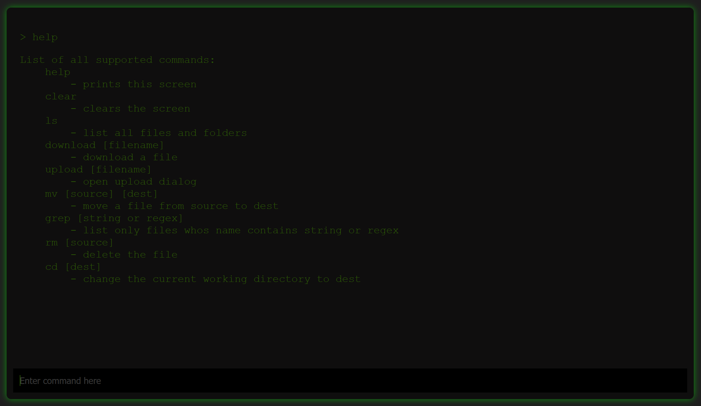

# CloudShell
A lightweight, simple to use and (linux-nerd-)intuitive way to manage your files in the cloud. 

CloudShell works by emulating a console that lets you list, upload, download, move and do so much more with your files. 

## Work in progress
This is by far finished. I am currently preparing for a new job that involves lots of c++ and thus I found it to be a good project. 

## Dependencies
This project uses [Crow](https://github.com/CrowCpp/Crow). If you want to compile it yourself, put the `crow/include` into `./include`. You also need [Asio](https://think-async.com/Asio/), because its a requirement of Crow. 

## Contributions
If you have Ideas and the time to make them work, feel free, to open a PR. Every PR is welcome. 
